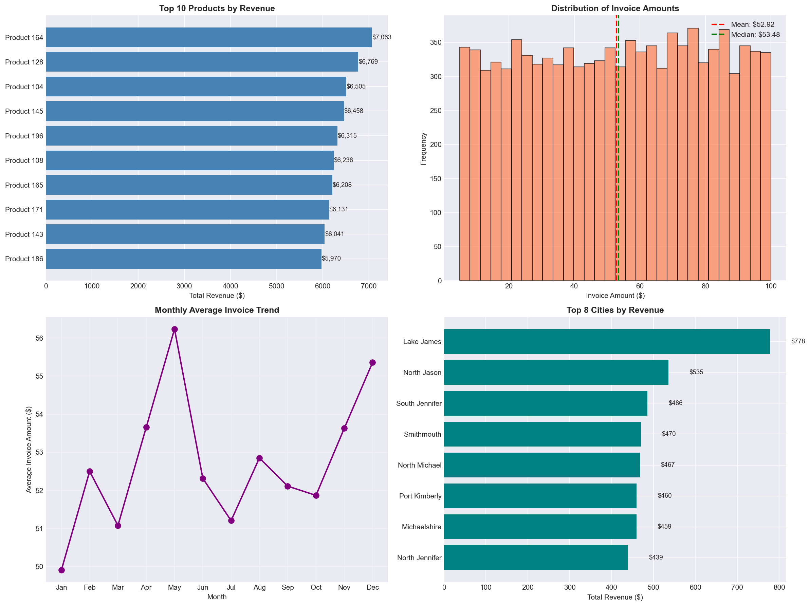

<div align="center">

# 📊 Invoice Data Analysis Project

## Transform Raw Invoice Data into Actionable Business Insights

[](https://www.python.org/)
[](https://pandas.pydata.org/)
[](https://jupyter.org/)
[](LICENSE)
[](https://github.com/yourusername)

</div>

---

## 🎯 Project Overview

This is a **complete end-to-end data analysis project** that processes over **10,000+ invoice records** and extracts **actionable business intelligence**. No expensive BI tools needed — just pure Python magic! 🪄

The project automates the entire data pipeline from **raw CSV ingestion** → **data cleaning** → **exploratory analysis** → **insights generation** → **professional Excel reporting** + **visual dashboard**.

### ✨ Why This Project Matters

| Problem | Solution |
|---------|----------|
| ❌ Messy, unstructured invoice data | ✅ Automated data cleaning & validation |
| ❌ No visibility into sales patterns | ✅ Revenue trends by month, day, quarter |
| ❌ Don't know top customers/products | ✅ Automatic ranking & segmentation |
| ❌ Manual reporting takes hours | ✅ One-click Excel + PDF dashboard |
| ❌ Can't identify geographic opportunities | ✅ Revenue breakdown by city & profession |

---

## 📸 Project Preview

<div align="center">
  
### Visual Dashboard Output



### Excel Report Structure

| Sheet Name | Description |
|------------|-------------|
| 📋 **All Invoices** | Cleaned, processed invoice data |
| 📊 **Summary** | Key business metrics at a glance |
| 🏆 **Top Products** | Best-selling products by revenue |
| 👥 **Top Customers** | Highest spending customers |
| 🌍 **Revenue by City** | Geographic revenue breakdown |
| 💼 **Revenue by Profession** | Sales by customer occupation |
| 📈 **Monthly Trend** | Time-series revenue analysis |

</div>

---

## 🚀 Key Features

### 🔄 Data Processing
- ✅ Automatic CSV ingestion & validation
- ✅ Date parsing & standardization  
- ✅ Duplicate detection & removal
- ✅ Missing value handling
- ✅ Data type optimization
- ✅ Customer name & invoice ID generation

### 📊 Analysis Capabilities
- 💰 **Revenue Analytics**: Total, average, median, distribution
- 🏷️ **Product Intelligence**: Top performers by revenue & quantity
- 👤 **Customer Insights**: Lifetime value, segmentation, frequency
- 🗺️ **Geographic Analysis**: Revenue by city & region
- 📅 **Temporal Trends**: Monthly, quarterly, day-of-week patterns
- 👔 **Demographic Insights**: Revenue by customer profession
- 📎 **Pivot Tables**: Multi-dimensional data exploration

### 📤 Export Features
- 📑 **Excel Report**: Multi-sheet professional report
- 📊 **Visual Dashboard**: 4-in-1 infographic dashboard
- 🔄 **Reusable Function**: Process any new invoice file

---

## 📈 Sample Insights from the Data

```python
╔════════════════════════╦══════════════════════╗
║       METRIC           ║       VALUE          ║
╠════════════════════════╬══════════════════════╣
║ 💰 Total Revenue       ║ $529,182.36          ║
║ 📝 Total Transactions  ║ 10,000               ║
║ 💵 Average Order Value ║ $52.92               ║
║ 📦 Total Units Sold    ║ 50,059               ║
║ 👥 Unique Customers    ║ 9,769                ║
║ 🏷️ Unique Products      ║ 100                  ║
╚════════════════════════╩══════════════════════╝

🏆 Top Product:     Product 164     ($7,063.05)
👤 Best Customer:   Anthony Wright  ($99.99)
🌆 Best City:       Lake James      ($778.43)
📅 Peak Month:      August          ($19,025.48)
⭐ Best Day:        Friday          ($30,914.01)
